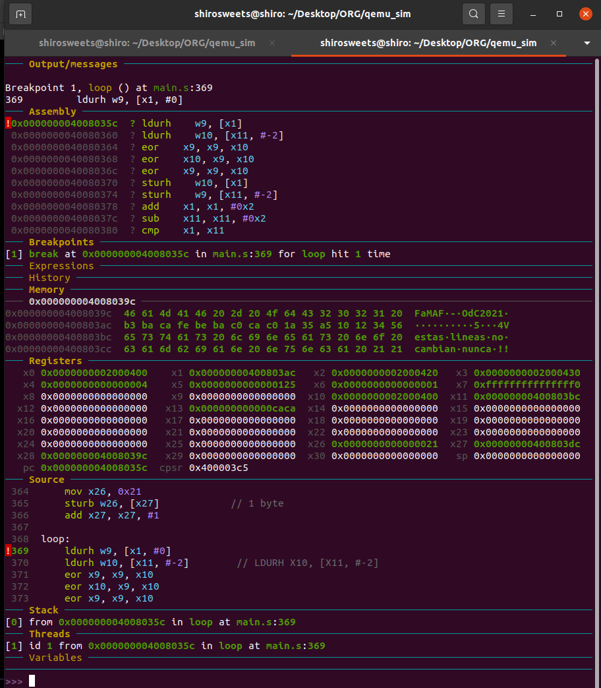

# Error en la correción del parcial 2 (ejercicio 3) de Organización del Computador 2021
En el ejercicio 3 no fue correctamente colocadas los checkeos de las respuestas. En este repositorio se hizo la traducción del código de LEGv8 a Assembly.

# Contenido
- [Proceso](#proceso)
  - [Imagen de los datos](#imagen-de-los-datos)
  - [Imagen del enunciado](#imagen-del-enunciado)
  - [Resultado en GDB](#resultado-en-gdb)
- [¿Cómo debugearlo?](#¿cómo-debugearlo?)
- [Makefile](#makefile)
- [Documentación](#documentación)
- [Swap con XOR](#swap-con-xOR)
---
# Proceso

## Imagen de los datos
<p align="center">
  
</p>

## Imagen del enunciado:
<p align="center">
  
</p>

## Resultado en GDB

Seteamos el `b loop`
<p align="center">
  
</p>

Valor inicial: `continue`
<p align="center">
  
</p>

`continue`
<p align="center">
  
</p>

`continue`
<p align="center">
  
</p>

`continue`
<p align="center">
  
</p>

**Fin...**

# ¿Cómo debugearlo?
Primero asegurarse que no haya ningún archivo de la compilación anterior:
> `make clean`

Luego:
> `make`

En una terminal:
> `qemu-system-aarch64 -s -S -machine virt -cpu cortex-a53 -machine type=virt -nographic -smp 1 -m 64 -kernel kernel.img`

En otra terminal, en el mismo path:
> `gdb-multiarch -ex "set architecture aarch64" \-ex "target remote localhost:1234" \-ex "add-symbol-file main.o 0x0000000040080000" \-ex "dashboard registers -style list 'x0 x1 x2 x3 x4 x5 x6 x7 x8 x9 x10 x11 x12 x13 x14 x15 x16 x17 x18 x19 x20 x21 x22 x23 x24 x25 x26 x27 x28 x29 x30 sp pc cpsr'" \-ex  "stepi 6" \-ex "dashboard memory watch 0x000000004008039c 64"`

> `b loop`

> `continue`

Si ya se tiene el dashboard memory watch insertarlo en el comando de arriba (el puesto es el mío y puede variar si agregan/quitan líneas de código o instrucciones).

Si no se tiene o está desalineado:</p>

En la instrucción **[**`adr x28, meMori`**]** se guardó la dirección de origen del la memoria a observar, lo que hay que hacer es correr todos los pasos anteriores y llegar al punto donde se llega al primer loop (usar el breakpoint del **loop** ya hecho sirve para esto), y copiar la dirección de memoria **guardada en el registro x28**. Luego se reemplaza el siguiente valor en el comando de *gdb*:

`\-ex "dashboard memory watch` **`0x000000004008039c`** `64"`

por el valor copiado del registro.

Se debe matar el proceso del qemu de la terminal, luego de haberlo realizado, se debe realizar los pasos anteriores **recordando** reemplazar el comando por el registro obtenido anteriormente.

Es decir, en una terminal:
> `qemu-system-aarch64 -s -S -machine virt -cpu cortex-a53 -machine type=virt -nographic -smp 1 -m 64 -kernel kernel.img`

En otra terminal, en el mismo path:
> `gdb-multiarch -ex "set architecture aarch64" \-ex "target remote localhost:1234" \-ex "add-symbol-file main.o 0x0000000040080000" \-ex "dashboard registers -style list 'x0 x1 x2 x3 x4 x5 x6 x7 x8 x9 x10 x11 x12 x13 x14 x15 x16 x17 x18 x19 x20 x21 x22 x23 x24 x25 x26 x27 x28 x29 x30 sp pc cpsr'" \-ex  "stepi 6" \-ex "dashboard memory watch VALOR_NUEVO 64"`

> `b loop`

> `continue`

# Makefile
Se podría modificar el makefile para que haga las diferentes partes que se necesita para debugearlo para ahorrar "pasos".

# Documentación
- [Referencia ARMv8](docs/ARMv8_Reference_Manual.pdf)
- [Green Card LEGv8 Arreglada](docs/GreenCardLEGv8_OK.pdf)

# Swap con XOR
En el loop de este ejercicio se hace uso de una [técnica](https://en.wikipedia.org/wiki/XOR_swap_algorithm) que permite intercambiar el valor de dos variables sin el uso dos una variable auxiliar extra.

Un ejemplo en C que usa variable auxiliar sería:
```c
int a = 10;
int b = 20;
int aux;
aux = a;
a = b;
b = aux;
```

Pero con las propiedades del `XOR` podemos no usar el aux
```c
int a = 10;
int b = 20;
a = a ^ b;
b = a ^ b;
a = a ^ b;
```

Por lo tanto se concluye que en el ejercicio, las instrucciones
```arm
eor x9, x9, x10
eor x10, x9, x10
eor x9, x9, x10
```
Intercambian `x9` y `x10`.
